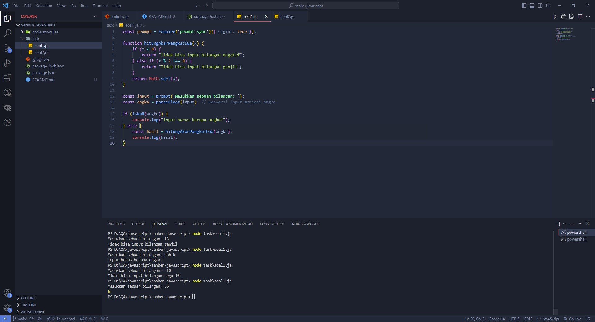

# Javasciprt for Quality Assurance

Repository for **Tugas Pekanan** Sanbercode Quality Assurance Automation Bootcamp. This is a practice for running code with javascript language. **Author: Habib Akbar**

## Installation and Setup
To set up and run this project locally, follow these steps:
note: Make sure your computer has node.js installed
link: https://nodejs.org/en/download/


1. **Clone the repository:**
    ```bash
    git clone https://github.com/hbibakbr/javascript-qa.git
    ```

2. **Navigate to the project directory:**
    ```bash
    cd javascript-qa
    ```

3. **Install dependencies:**
    ```bash
    npm install prompt-sync
    ```

4. **Run the tests:**
    ```bash
    node soal1.js
    ```

## Screenshots
This is a running code screenshots

### soal1.js


### soal2.js
